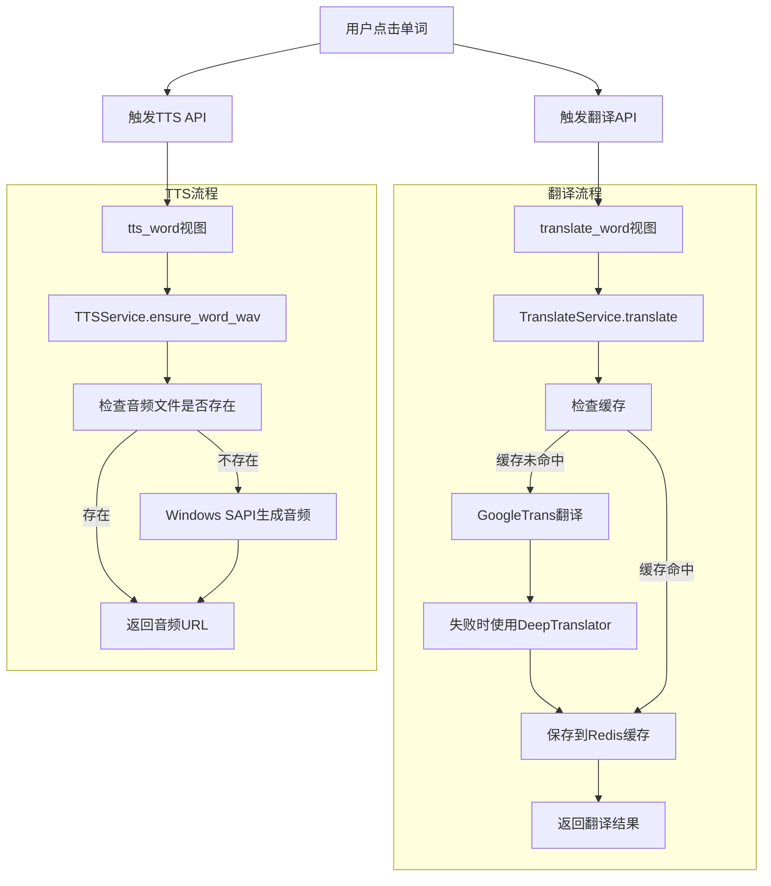

我将分析这个项目的系统结构和组件之间的关系，并用mermaid图表展示系统设计。

## 系统概述

这是一个字幕查找和学习系统，主要功能包括：
1. 搜索和浏览电视剧信息（通过TMDB API）
2. 下载字幕文件（通过OpenSubtitles API）
3. 解析字幕文件
4. 提供单词翻译和文本转语音（TTS）功能

## 系统架构图

## 详细组件关系图

## Django应用结构图

## 主要数据流图

## 单词查询功能流程图

## 异步任务处理图

这套系统采用了清晰的分层架构设计，将业务逻辑、数据访问、外部接口和表示层分离，便于维护和扩展。主要特点包括：

1. **服务层隔离**：每个核心功能都有专门的服务类负责
2. **仓储模式**：统一管理文件系统访问
3. **外部接口封装**：将API调用封装在独立模块中
4. **异步处理**：使用Celery处理耗时任务
5. **缓存机制**：使用Redis缓存翻译结果
6. **可扩展设计**：TTS支持多种后端实现

